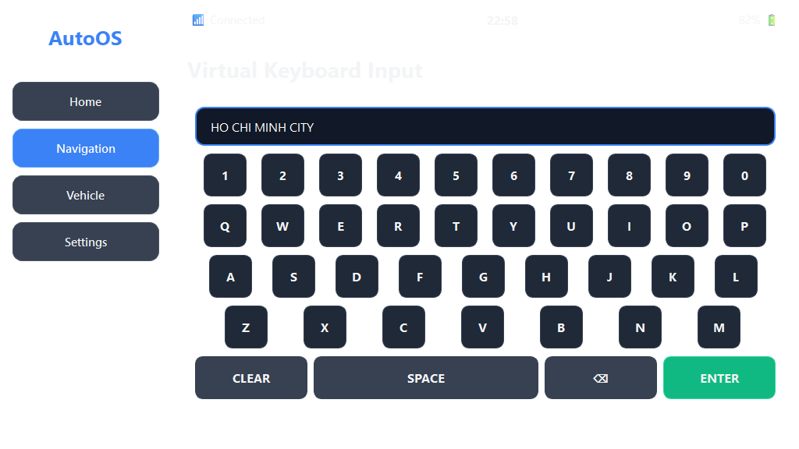

# Vision-Based UI Navigation Agent - Summary Report

## Task Overview
- **User Instruction**: Open Navigation and type HO CHI MINH CITY in the textbox. 
Go to Vehicle and Swipe Limit to 100%. 
Done.
- **Execution Date**: 2026-07-10 22:58:20
- **Total Steps Run**: 7
- **Total Elapsed Time**: 32.81 seconds

## Final Task Outcome
- **Status**: **Success**
- **Quantitative Task Completion Rate**: 100.0%

## Quantitative Performance
- **Successful Steps**: 7
- **Failed Steps**: 0

## Step-by-Step Execution Summary
| Step | Screen | Action Type | Coordinates | Value/Text | Execution Result | Elapsed (s) | Error Message |
|------|--------|-------------|-------------|------------|------------------|-------------|---------------|
| 1 | home | CLICK | [16, 165] | - | success | 3.50 | - |
| 2 | navigation | CLICK | [16, 165] | - | success | 3.44 | - |
| 3 | navigation | CLICK | [16, 165] | - | success | 3.14 | - |
| 4 | navigation | CLICK | [240, 127] | - | success | 3.30 | - |
| 5 | keyboard | TYPE | [0, 0] | HO CHI MINH CITY | success | 3.28 | - |
| 6 | navigation | CLICK | [240, 127] | - | success | 3.17 | - |
| 7 | keyboard | DONE | [0, 0] | - | success_done | 3.96 | - |

## Detailed Step Breakdown
### Step 1: CLICK ✅
- **Screen**: `home`
- **Action Details**: `Coordinates: [16, 165]`, `Value: `
- **Execution Result**: `success`
- **Visual Capture**: 

### Step 2: CLICK ✅
- **Screen**: `navigation`
- **Action Details**: `Coordinates: [16, 165]`, `Value: `
- **Execution Result**: `success`
- **Visual Capture**: 

### Step 3: CLICK ✅
- **Screen**: `navigation`
- **Action Details**: `Coordinates: [16, 165]`, `Value: `
- **Execution Result**: `success`
- **Visual Capture**: 

### Step 4: CLICK ✅
- **Screen**: `navigation`
- **Action Details**: `Coordinates: [240, 127]`, `Value: `
- **Execution Result**: `success`
- **Visual Capture**: 

### Step 5: TYPE ✅
- **Screen**: `keyboard`
- **Action Details**: `Coordinates: [0, 0]`, `Value: HO CHI MINH CITY`
- **Execution Result**: `success`
- **Visual Capture**: 

### Step 6: CLICK ✅
- **Screen**: `navigation`
- **Action Details**: `Coordinates: [240, 127]`, `Value: `
- **Execution Result**: `success`
- **Visual Capture**: 

### Step 7: DONE ✅
- **Screen**: `keyboard`
- **Action Details**: `Coordinates: [0, 0]`, `Value: `
- **Execution Result**: `success_done`
- **Visual Capture**: 

