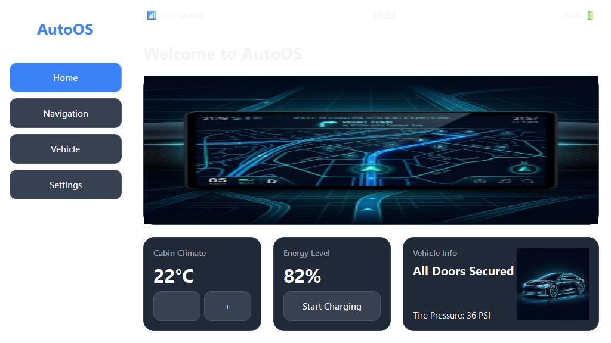
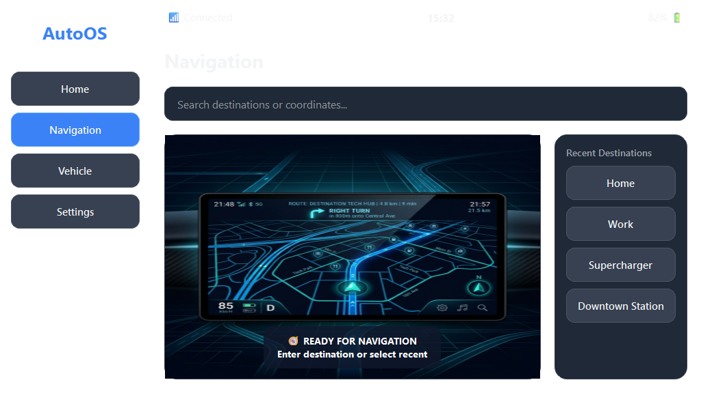
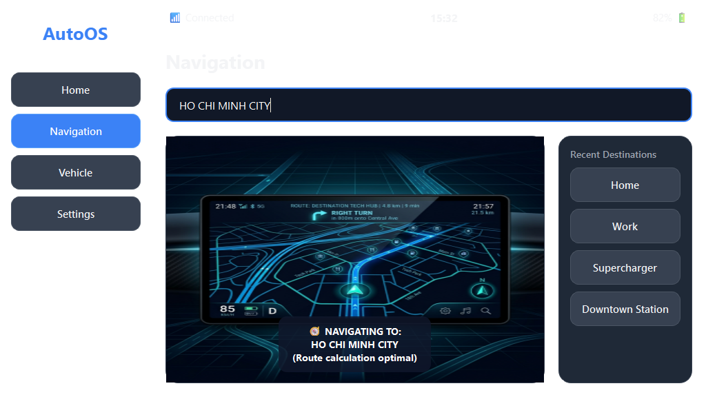
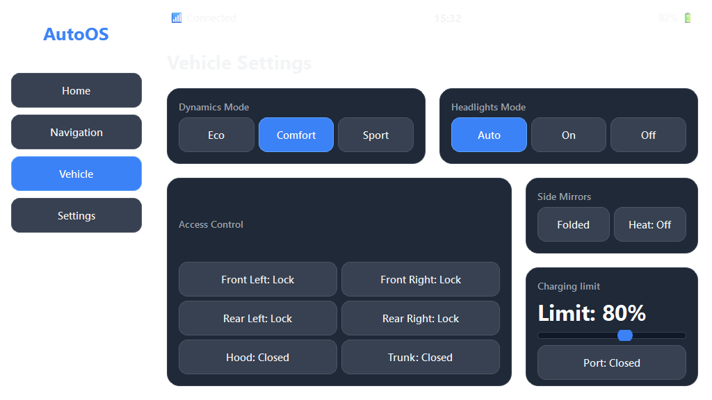

# Vision-Based UI Navigation Agent - Summary Report

## Task Overview
- **User Instruction**: Open Navigation and type HO CHI MINH CITY in the textbox. Go to Vehicle and Swipe Limit to 100%. Done
- **Execution Date**: 2026-07-06 15:32:21
- **Total Steps Run**: 5
- **Total Elapsed Time**: 8.77 seconds

## Final Task Outcome
- **Status**: **Success**
- **Quantitative Task Completion Rate**: 100.0%

## Quantitative Performance
- **Successful Steps**: 5
- **Failed Steps**: 0

## Step-by-Step Execution Summary
| Step | Screen | Action Type | Coordinates | Value/Text | Execution Result | Elapsed (s) | Error Message |
|------|--------|-------------|-------------|------------|------------------|-------------|---------------|
| 1 | home | CLICK | [110, 190] | - | success | 0.44 | - |
| 2 | navigation | CLICK | [622, 152] | - | success | 0.30 | - |
| 3 | keyboard | TYPE | [0, 0] | HO CHI MINH CITY | success | 1.54 | - |
| 4 | navigation | CLICK | [110, 250] | - | success | 0.28 | - |
| 5 | vehicle | DONE | [0, 0] | - | success_done | 0.21 | - |

## Detailed Step Breakdown
### Step 1: CLICK ✅
- **Screen**: `home`
- **Action Details**: `Coordinates: [110, 190]`, `Value: `
- **Execution Result**: `success`
- **Visual Capture**: 

### Step 2: CLICK ✅
- **Screen**: `navigation`
- **Action Details**: `Coordinates: [622, 152]`, `Value: `
- **Execution Result**: `success`
- **Visual Capture**: 

### Step 3: TYPE ✅
- **Screen**: `keyboard`
- **Action Details**: `Coordinates: [0, 0]`, `Value: HO CHI MINH CITY`
- **Execution Result**: `success`
- **Visual Capture**: 

### Step 4: CLICK ✅
- **Screen**: `navigation`
- **Action Details**: `Coordinates: [110, 250]`, `Value: `
- **Execution Result**: `success`
- **Visual Capture**: 

### Step 5: DONE ✅
- **Screen**: `vehicle`
- **Action Details**: `Coordinates: [0, 0]`, `Value: `
- **Execution Result**: `success_done`
- **Visual Capture**: 

